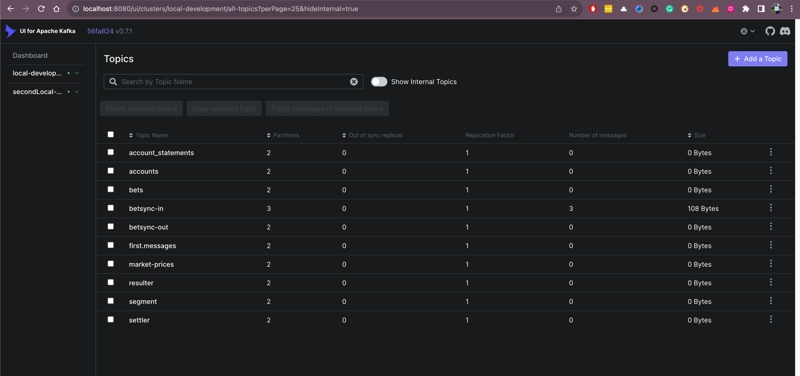

# kafka-local-dev

This repository contains a collection of Docker Compose templates to help you get started with multi-container applications.

Services included are:

- Kafka
- Kafka UI

## Table of Contents

- [Running all Services](#running-all-services)
- [Accessing the Services](#accessing-the-services)
    - [Kafka](#kafka)

### Running all Services

```bash
make run-local-stack
```
**_Note_:** This command will take a couple of minutes to start all services for the first time.

shut down all running containers and remove all images used by any service defined in the Compose file.

```bash
make clean-local-stack
```

If you don't see kafka topics in the kafka ui, you can run the following command to create a topic.

```bash
docker-compose -f docker-compose.kafka.yaml restart kafka-init-topics
```

### Run Just Kafka services
```bash
docker-compose -f docker-compose.kafka.yml up -d
```
# Accessing the Services
With the services running, you can access them locally as needed:

## Kafka

Kafka can be accessed at localhost:9092, also available via the Kafka UI at http://localhost:8080/.



